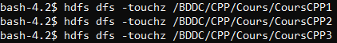

<h2 style="color:blue">TP 1 : Manipulation du système de fichiers HDFS</h2>

<h4 style="color:darkred">Etape 1 : Création du cluster hadoop via docker</h4>
<i>
	Dans cet exércice on utilise Docker afin de créer un cluster Hadoop sous forme de conteneurs docker, ce cluster se compose de : 
	 
	un namenode (le noeud du cluster hadoop qui gère le système de fichier HDFS, et qui stock les métadonnées des fichiers stockés)
	 
	5 datanodes (sont les noeuds du cluster hadoop qui stockent physiquement les fichiers sous forme de blocs en fonction du nombre de réplication)
	 
	un ressourcemanager (c'est le noeud du cluster hadoop qui gère l'utilisation globale des ressources (CPU, mémoire, etc.) dans ce dernier)
	 
	un nodemanager (exécute les tâches MapReduce, Spark... déstinées aux noeuds datanodes)
</i>

	Création du cluster Hadoop depuis le ficher cluster_hadoop/docker-compose.yaml (qui regroupe toutes les images et configuration 
	necessaires pour instancier tous ces conteneurs (namenode, datanode1, datanode2 ...)), en tapant la commande suivante :

	On s'assure que tous les conteneurs qui constituent le cluster Hadoop, sont "en cours d'éxecution", via la commande suivante

 
<h4 style="color:darkred">Etape 2 : Manipulation du HDFS</h4>

<b>1 - Création de l'arborescence suivante dans la racine du système de fichiers distribué Hadoop (HDFS): </b>

	Pour créer cette arborescence de répertoires, on doit d'abord accéder au conteneur namenode, (car c'est lui qui gère le stockage
	des fichiers sur le HDFS) via la commande suivante:	

	Ci dessous est la liste des commandes qui permettent de créer cette arborescence

	Voici la commande HDFS qui permet de lister ces répertoires :

 

	<b>
		2 - Création des fichiers CoursCPP1, CoursCPP2, CoursCPP3 dans dans le répertoire CPP, puis l'ajout du contenu 
		dans chaqu'un entre eux
	</b>

Commande qui permet de créer les fichiers

Affichage de l'état actuelle de l'arborescence

Les commandes qui permettent d'ajouter du contenu dans chacun de ces fichiers

 

<b>
	3 - Affichage du contenu des fichiers /BDDC/CPP/Cours/CoursCPP1, /BDDC/CPP/Cours/CoursCPP2, et /BDDC/CPP/Cours/CoursCPP3: </b>

 

	<b>
		4 - Copie les fichiers /BDDC/CPP/Cours/CoursCPP1, /BDDC/CPP/Cours/CoursCPP2, et /BDDC/CPP/Cours/CoursCPP3 vers le repersoire
		/BDDC/JAVA/Cours : 
	</b>

Affichage de l'état actuelle de l'arborescence

 

	<b>
		5 - Suppréssion du fichier /BDDC/JAVA/Cours/CoursCPP3 et renommage de /BDDC/JAVA/Cours/CoursCPP1 et de /BDDC/JAVA/Cours/CoursCPP2
		en réspectivement /BDDC/JAVA/Cours/CoursJAVA1 et /BDDC/JAVA/Cours/CoursJAVA2 : 
	</b>

Suppréssion de /BDDC/JAVA/Cours/CoursCPP3

Renommage de /BDDC/JAVA/Cours/CoursCPP1 et de /BDDC/JAVA/Cours/CoursCPP2 en réspectivement /BDDC/JAVA/Cours/CoursJAVA1 et /BDDC/JAVA/Cours/CoursJAVA2

Voici l'état actuelle de l'arborescence

 

	<b>
		6 - Création du répertoire Mes_TPs dans le système du fichiers local, et création des fichiers TP1CPP, 
		TP2CPP, TP1JAVA, TP2JAVA, TP3JAVA dans ce répertoire
	</b>

 

	<b>
		7 - Copie les fichiers TP1CPP, TP2CPP à partir du système de fichiers local, vers le répertoire /BDDC/CPP/TPs du HDFS
	</b>

 

	<b>
		8 - Copier les fichiers TP1JAVA, TP2JAVA à partir du système de fichiers local, vers le répertoire /BDDC/JAVA/TPs du HDFS
	</b>

 

	<b>
		9 - Affichage de tout le contenu du répertoire BDDC (de manière récursive)
	</b>

 

 

	<b>
		10 - Supprésion du fichier TP1CPP du répertoire /BDDC/CPP/TPs
	</b>

 

	<b>
		11 - Supprésion du répertoire JAVA (de façon définitive)
	</b>

 

Voici l'état finale de notre arborescence

