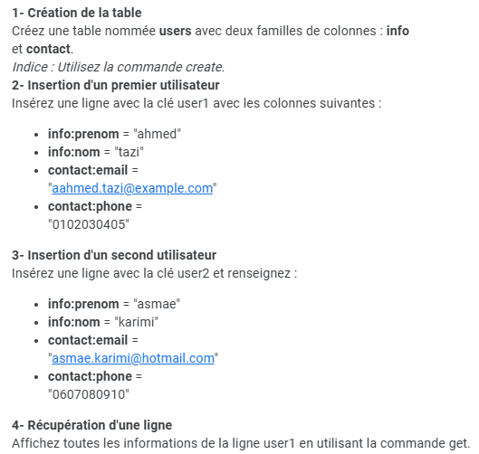

<h2>TP 2 : Manipulation d'une base de données HDFS via des commandes shell</h2>
<h3>
	Objectifs :
</h3>

 

<i>
	Dans ce TP, on va créer un cluster HBase en utilisant Docker, ce cluster est composé des noeuds suivants : 
	
	**un noeud HMaster, qui parmis ses rôles les plus principaux on trouve :**
	
	- Assignation des région aux RegionServers</li>
	- Géstion de split quand une region devient trop massive en terme de nombre de données
	- Réassignation des régions depuis les RegionServers mort vers des RegionServers actifs
	- Géstion de la structure de la base de données et des tables
	
			
		
	**un noeud RegionServer, qui parmis ses rôles les plus principaux on cite :**
	- Gestion des régions
	- Géstion de lecture/ecriture des données dans ses régions
	- Stock les données physiquement sous forme de fichiers HFiles dans le HDFS
	- Stock les logs sous forme de fichiers WAL (Write-Ahead Log) dans HDFS afin d'assurer la durabilité du 	                        système
	- Maintient un MemStore qui est un cache mémoire pour les écritures récentes avant flush vers HDFS pour 
	- accélerer la lecture
	
 	**un noeud ZooKeeper, qui dans le cas d'un cluster HBase il permet  :**
	- De découvrir les services (Les client hbase, utilisent zookeeper pour trouver le HMaster actif, et les RegionsServers)
	- La coordination (HMaster utilise Zookeeper pour suivre les RegionsServers disponible)
	- En cas de plusieurs HMaster, Zookeeper détermine le leader actif 
 	- Verouillage des métadonnées dans le cas d'un accès concurrent
	
</i>
 
<h3>Etape 1 : Initialisation du cluster via docker</h3>

<b>Voici la commande qui permet d'initialiser le cluster sous forme de conteneurs docker</b>

 
<h3>Etape 2 : Réalisation du TP</h3>

<b>1 - Création de la table users avec deux familles de colonnes "info" et "contact"</b>

<i>
	Dans notre cas on doit d'abord accéder au cluster <b>cluster_hbase-hbase-master-1</b> puisque ce dérnier installe le client HBase pour interagir avec le service HMaser, puis on tape
	 la commande "hbase shell" afin d'interagir avec HMaster via un shell en ligne de commande
</i>

 

<b>2 - Insértion du premier utilisateur qui a comme clé user1 (ahmed)</b>

 

<b>3 - Insértion du desième utilisateur qui a comme clé user2 (asmae)</b>

 

<b>4 - Récupération de la ligne qui a comme clé "user1"</b>

 

<b>5 - Scan complet de la table</b>

 

<b>6 - Mise à jour de l'email de l'utilisateur "user2" (en remplaçant l'encienne valeur par asmae.karimi@gmail.com)</b>

 

<b>7 - Suppréssion d'une colonne (suppréssion de la colonne contact:phone de la ligne user1)</b>

 

<b>8 - Suppréssion complete d'une ligne (supprimer la ligne qui sont RowId est user2)</b>

 

<b>9 - Ajout d'une nouvelle colonne (fax) dans la famille de colonnes contact</b>

Cette opération ne peut pas être effectuée car les colonnes qualifiers (email, phone, fax ..) ne font pas partie de la structure de la table, cependant on 
peut durant l'ajout d'un nouvelle enregistrement via la commande "put" spécifier une valeur à la colonne contact:fax

 

<b>10 - Scan en utilisant une plage de clé de user1 à user4 (afin de n'afficher que les lignes qui leurs RowId sont entre user1 et user4 non inclu)</b>

 

<b>11 - Comptage de lignes</b>

 

<b>11 - Affichage de la déscription de la table (familles de clonnes et leurs options)</b>

